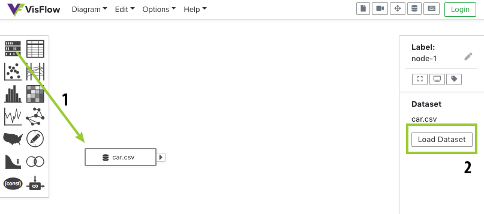
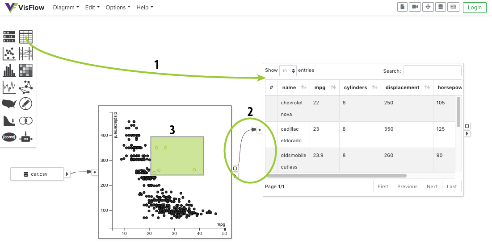
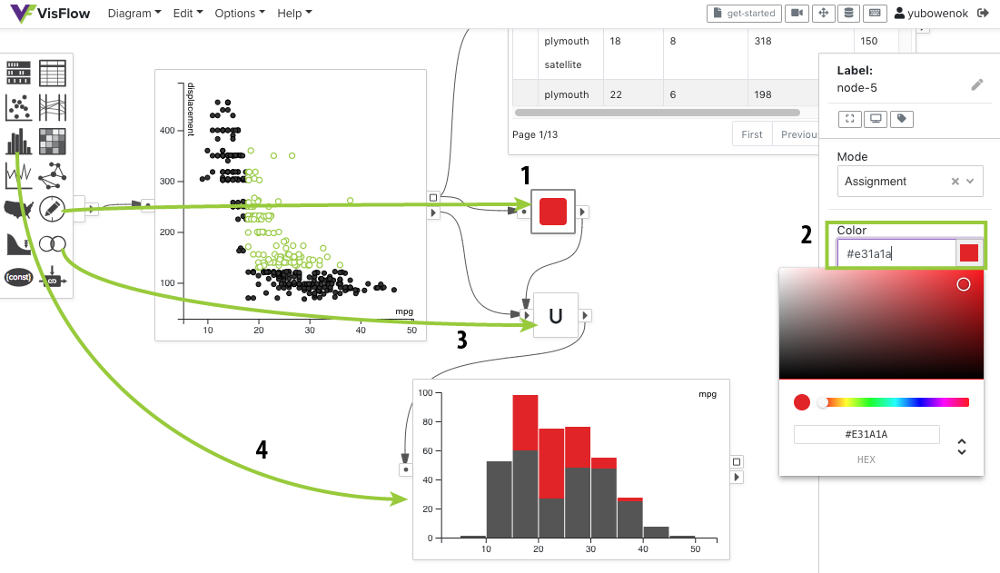

# Get Started

::: tip VisFlow Demo
You may try out VisFlow by without creating an account.
VisFlow works under the demo mode without login.
You may complete all the steps below under the demo mode.
:::

## Load a Dataset

Drag a <node-type type="data-source"/> onto the canvas.
Click on the created data source and its option panel will pop up on the right of the screen.
Click <ui-button text="Load Dataset"/> in the option panel to select a dataset to load in the data source.

::: tip Demo Datasets
A few sample datasets are available under the demo mode.
If you would like to use a custom dataset, you need to create an account and upload it.
To create an account, click <ui-button text="Login"/> at the top-right corner and then click <ui-button text="Signup"/>.
:::

## Create a Visualization
Let's create a <node-type type="scatterplot"/> to visualize the dataset we just loaded.
After dragging a scatterplot to the canvas, connect the <port-type type="output"/> of the data source to the <port-type type="input"/> of the scatterplot.
You may change the <ui-prop node-type="scatterplot" prop="x-column"/> and <ui-prop node-type="scatterplot" prop="y-column"/> and other settings of the scatterplot in its option panel.

::: tip Keyboard Shortcut
You may press the A key to use the Quick Node Panel.
Drag a node from the Quick Node Panel to create it.
:::

## Forward Interactive Selection
Interactive selection in a visualization can be forwarded to another node for detailed exploration.
We can create a <node-type type="table"/> to inspect the selected points in the scatterplot.
Connect the <port-type type="selection"></port-type> of the scatterplot to the <port-type type="input"></port-type> of the table.
When the selection in the scatterplot changes, the newly selected rows are reactively shown in the table.

## Highlight Interactive Selection
VisFlow allows you to assign visual properties to data items so that interesting subsets of the input data can be brushed and linked across multiple visualizations.
You may use a <node-type type="visual-editor"/> to set the visual properties on the data items.
In this example, let's highlight the selection from the scatterplot in a histogram.

First create a visual editor for the selection from the scatterplot.
Set the <ui-prop node-type="visual-editor" prop="assignment-mode-options" text="Color"/> visual property to red in the option panel of the visual editor.

Then create a <node-type type="set-operator"/> and set its <ui-prop node-type="set-operator" prop="mode" text="Mode"/> to <ui-value text="Union"/>.
Merge the highlighted selection into the full dataset by connecting both the <port-type type="selection"/> of the visual editor and the <port-type type="output"/> of the scatterplot to the <port-type type="multi-input"></port-type> of the union node.
Finally create a <node-type type="histogram"/> and connect it to the <port-type type="output"></port-type> of the union node.

This flow diagram shows the distribution of the selected points from the scatterplot in the histogram.

## Filter the Data
You may add an <node-type type="attribute-filter"/> to find data items based on their attribute values.
In this case let's find the cars that have an <ui-value text="American"/> origin.

Create an attribute filter and connect it to the <port-type type="selection"/> of the histogram.
Keep the <ui-prop node-type="attribute-filter" prop="filter-types" text="filter type"/> as <ui-value text="Pattern"/> filter,
and set the <ui-prop node-type="attribute-filter" prop="column" text="column"/> to be <ui-value text="origin"/> in the option panel.
Add a pattern <ui-value text="American"/> in the patterns list below.

Now draw a rectangular box to select a few stacked bars in the histogram.
The attribute filter will find among the selected cars in the histogram those that have an American origin.
To show the details of those cars, we may further add a <node-type type="table"/>.
Feel free to explore other filter types as you like.
For more details on how to use an attribute filter, see the <page-link link="/node/attribute-filter.html" text="attribute filter documentation"/>.

## Subset Flow
You may have noticed that the red color assigned earlier by the visual editor keeps in effect in the histogram and the table.
This is because VisFlow uses a [subset flow model](/dataflow/subsetflow.md) that renders everything with respect to their [visual properties](/dataflow/diagram.html#visual-property).

In the subset flow, all data transmitted in the dataflow are subsets of table rows from an input table.
The input table rows are never mutated, except that visual properties can be assigned and modified down the dataflow.
Such a design ensures that visual properties can be used to keep track of subsets unambiguously, so that brushing and linking can be well supported for visual data exploration.

## Next Steps

That's it!
You have successfully completed the basics of VisFlow.
Learn more about the dataflow model behind VisFlow in the [Dataflow Section](/dataflow/).
Checkout the [Node Types](/node/) in VisFlow for the detailed usage of each node type.

Alternatively, you may go ahead and freely explore VisFlow yourself.
Remember to come back whenever you have questions about specific aspects of the system.
