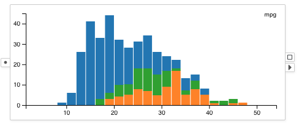

# Histogram

A <node-type type="histogram"/> renders the distribution of data items on one selected column.
The histogram counts each distinct value in the selected column.
It displays one bar for each distinct categorical value,
or one bar for a range of continuous values.

## Example

A histogram showing the mpg distribution of the cars:
The bars in the histogram are color encoded by the origin countries of the cars and shown as stacked bars.

## Selection
Selection in the histogram is performed on the stacked bars.
Groups of data items with exactly the same visual properties are selected together.

## Visual Properties
| Type | Effect |
|:----:| ------ |
| color | Fill color of the bar |
| border | Border color of the bar |
| size | Not supported |
| width | Width of the bar border |
| opacity | Opacity of the bar |

## Options
### Column
Configures the column for which the distribution is shown for.

### Number of Bins
Configures the approximate number of bins to create.
The chart may choose a number close to the given value that has the best readability.
